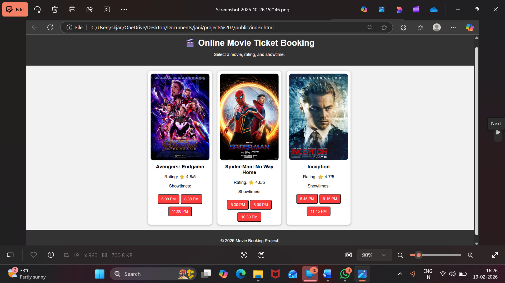
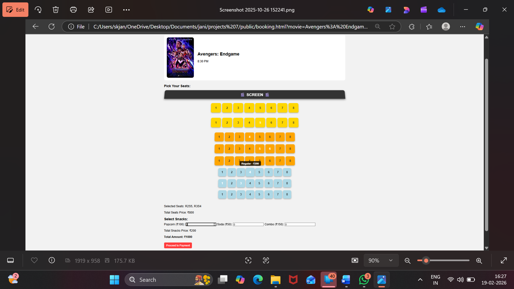
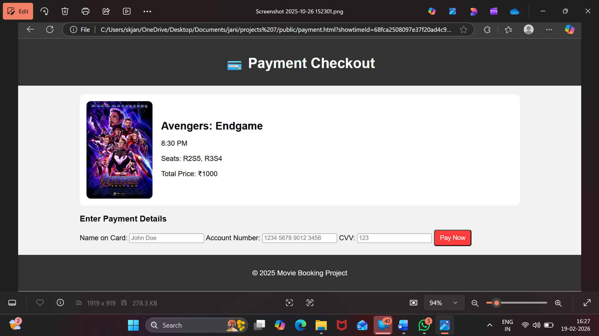
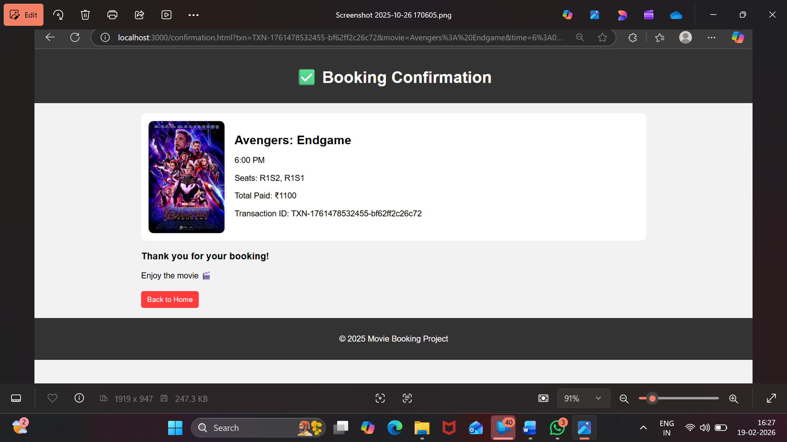
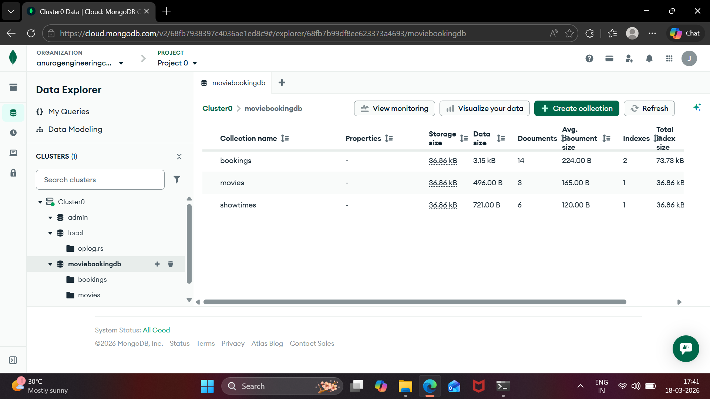
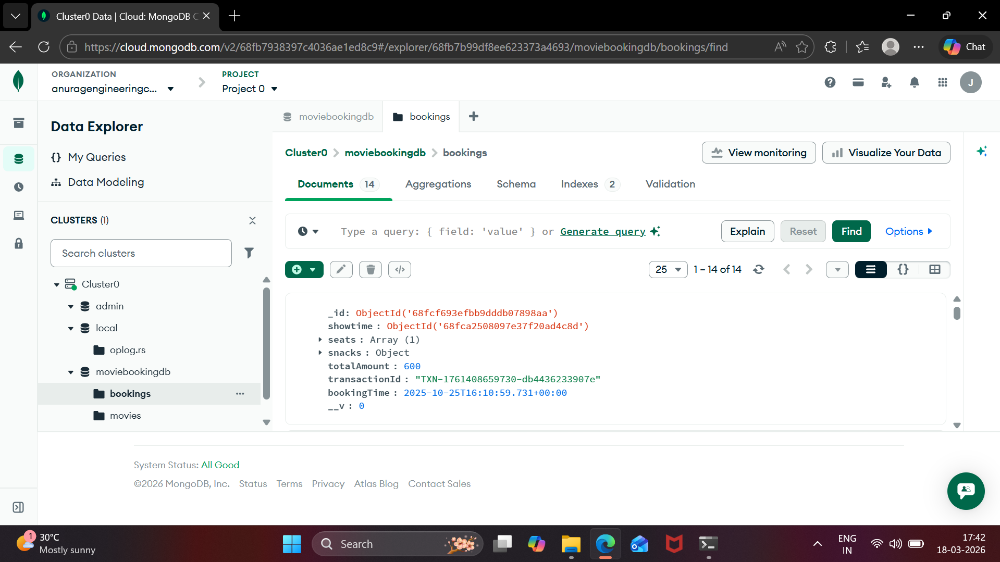

# 🎬 Movie Ticket Booking System

## 🔍 Overview
This is a full-stack web application that allows users to book movie tickets online. The system provides a seamless experience from browsing movies to booking seats and confirming payments.

---

## 🚀 Features
- Browse available movies and showtimes  
- Select seats with dynamic pricing (Premium, Mid, Regular)  
- Add snacks (Popcorn, Soda, Combo)  
- Real-time seat availability  
- Secure booking with server-side validation  
- Booking confirmation with transaction ID  

---

## 🛠 Tech Stack
- Frontend: HTML, CSS, JavaScript  
- Backend: Node.js, Express.js  
- Database: MongoDB (Mongoose)  

---

## ⚙️ Setup Instructions

1. Install dependencies:
   npm install

2. Add your MongoDB connection string in server.js:
   const ATLAS_URI = "YOUR_MONGODB_CONNECTION_STRING"

3. Run the server:
   node server.js

4. Open browser:
   http://localhost:3000

---

# 📸 Application Workflow

## 🏠 Home Page
The home page displays all available movies along with their posters, ratings, and showtimes. Users can select a movie and proceed to booking.

---

## 🎟️ Booking Page
Users can select their preferred seats. Different rows have different pricing categories such as premium, mid, and regular.

---

## 💳 Payment Page
Users can add snacks and view the total price. The backend calculates the final amount securely to prevent manipulation.

---

## ✅ Payment Successful
After successful payment, the system generates a unique transaction ID and confirms the booking.

---

## 📄 Booking Confirmation
Users can view their booking details including movie name, seats, timing, and total price.

---

## 🗄️ Database (MongoDB)
The database stores movies, showtimes, and booking details.

### 📊 Database View 1

### 📊 Database View 2

---

## 💡 Key Highlights
- Implemented REST API architecture  
- Prevented double booking using seat validation  
- Server-side price verification for security  
- Dynamic pricing system for seats and snacks  

---

## 🎯 Conclusion
This project demonstrates strong full-stack development skills, including backend logic, database integration, and real-world problem-solving.
